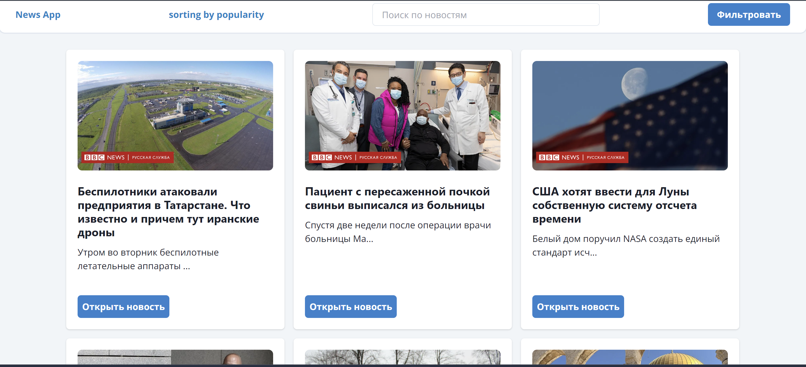
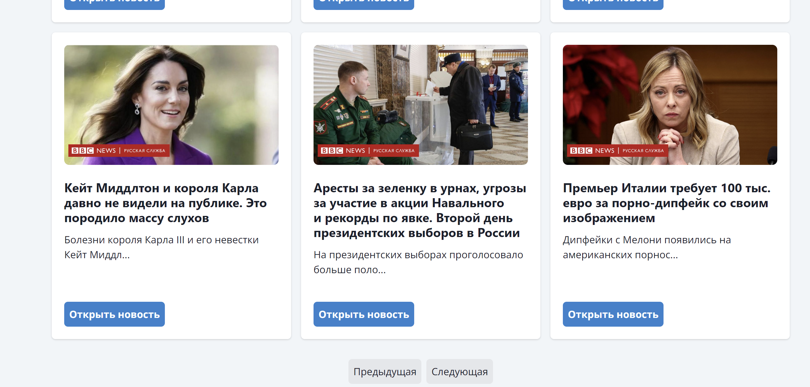
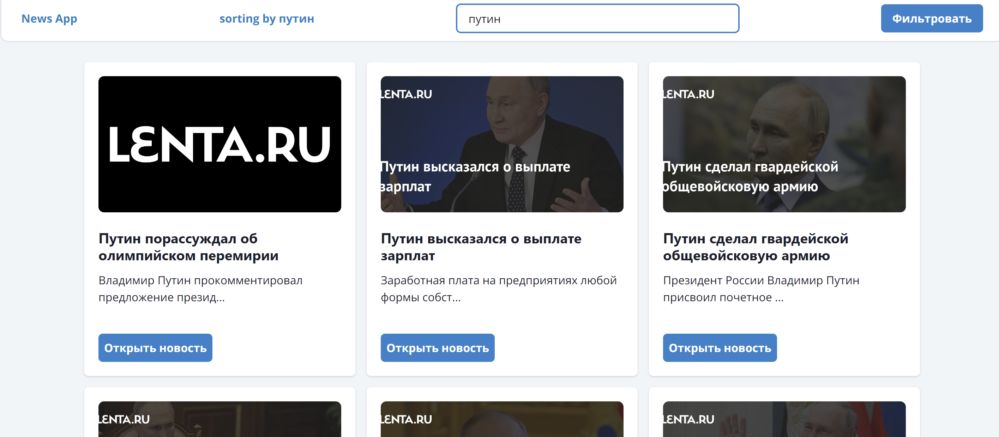
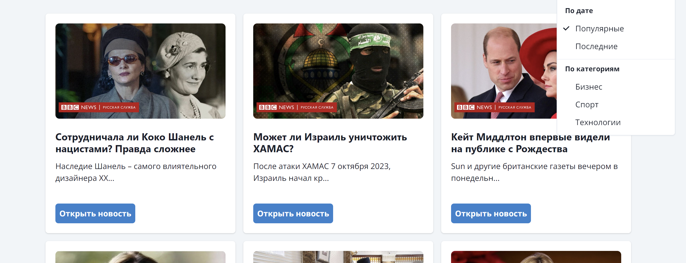

# Проект "News app"

## Описание проекта

Этот проект разработанный для участия в nFactorial Incubator - является веб-приложением, разработанным с использованием фреймворка Next.js и языка программирования TypeScript. Приложение представляет собой ленту новостных статей.

## Функции приложения

1. **Отображение списка новостных статей на фронтенде с данными с Api**
2. **Пользователь может кликнуть по статье и открыть ее более детально в первоисточнике**
3. **Реализована пагинация для управления отображением новостных статей**
4. **Можно фильтровать новости по категориям**
5. **Обеспечена функциональность поиска, позволяющая пользователям находить новости по ключевым словам**
6. **Включена функцию для сортировки новостных статей по дате публикации, чтобы первыми отображались последние новости и по популярности, чтобы первыми отображались самые популярные новости**
7. **Использован API сервис под названием NEWS API который предоставляет новостные статьи с различных мировых источников**
8. **Приложение было развернуто на сервисе хостинга, но так как в выбранном API есть система подписок, поэтому cors настроен только на локальный сервер. К сожалению я это поздно заметил**

## Процесс проектирования и разработки

1. **Выбор технологий**:

   - **Next.js и TypeScript**: Было решено использовать Next.js в связке с TypeScript для создания мощного и эффективного веб-приложения.
   - **Chakra UI и Tailwind**: Для создания пользовательского интерфейса были использованы библиотеки Chakra UI и Tailwind для обеспечения современного и отзывчивого дизайна.
   - **Redux Toolkit**: Для управления состоянием приложения выбор пал на Redux Toolkit для обеспечения эффективного управления данными.
   - **Use Debounce**: Использование `useDebounce` для оптимизации производительности в обработке пользовательского ввода и запросов к API.

2. **Проектирование пользовательского интерфейса**:

   - В процессе проектирования интерфейса уделено особое внимание простоте и интуитивной понятности.
   - Использование компонентов Chakra UI и стилей Tailwind для создания современного и приятного визуального стиля.

3. **Разработка приложения**:
   - **Компонентная архитектура**: При разработке приложения использовалась стандартная архитектура Next js(App) так как она предоставляет довольно удобную и гибкую возможность для проектирования приложения
   - **Использование Redux Toolkit**: Для управления состоянием приложения был использован Redux Toolkit для упрощения процесса разработки и обеспечения масштабируемости.
   - **Оптимизация производительности**: Использование `useDebounce` для оптимизации обработки пользовательского ввода и запросов к API, что позволяет уменьшить нагрузку на сервер и улучшить пользовательский опыт.

## Запуск приложения

1. Для начала нужно клонировать данный репозиторий к себе с помощью git clone [путь к репозиторию]
2. После клонирования запустить и ввести команду в терминале npm i либо npm install для установления всех зависимостей
3. После установки всех зависимостей можно запустить приложение с помощью команды npm run dev.
4. Чтобы увидеть приложение нужно будет перейти по адресу [http://localhost:3000](http://localhost:3000)

## Скрины с приложения

## Bonus level
Вот ссылка на задеплоенный проект [https://news-app-weld-gamma.vercel.app/](https://news-app-weld-gamma.vercel.app/), но так как я уже выше писал, что api не предоставляет услуги для захощенных проектов(только локальные), в консоли можно увидеть, что cors блочит. Извиняюсь за это, поздно заметил
